# Architecture Documentation

**📚 Documentation Navigation:**
[🏠 README](../README.md) | **🏗️ Architecture Guide** | [🔌 API Guide](./API.md) | [📋 Testing Guide](./TESTING.md)

---

## 🏗️ System Architecture Overview

UddoktaHut follows a modern, component-based architecture with clear separation of concerns, optimized performance, and scalable design patterns.

## 📊 Complete Frontend Architecture Diagram

```mermaid
graph TB
    subgraph "User Layer"
        U[👤 User]
        B[🌐 Browser]
    end

    subgraph "Next.js App Router"
        subgraph "Pages"
            LP[🏠 Landing Page]
            AUTH[🔐 Auth Pages]
            DASH[📊 Dashboard]
            STORE[🏪 Store Pages]
            ONBOARD[📝 Onboarding]
        end

        subgraph "Middleware"
            MW[🛡️ Auth Middleware]
            MW --> AUTH
            MW --> DASH
        end
    end

    subgraph "Component Architecture"
        subgraph "Context Providers"
            UC[👤 UserContext]
            SC[🏪 ShopContext]
            TC[🎨 ThemeContext]
            RQ[🔄 React Query]
        end

        subgraph "Component Layer"
            CC[🔧 Common Components]
            DC[📊 Dashboard Components]
            SUI[🏪 Shop UI Components]
            UI[🎨 UI Components]
            TEMP[📋 Template Registry]
        end

        subgraph "Business Logic"
            HOOKS[🪝 Custom Hooks]
            ACTIONS[⚡ API Actions]
            VAL[✅ Validation]
        end
    end

    subgraph "External Services"
        API[🔌 Backend API]
        CDN[📦 CDN/Assets]
        AUTH_SVC[🔐 Auth Service]
    end

    U --> B
    B --> LP
    B --> AUTH
    B --> DASH
    B --> STORE
    B --> ONBOARD

    LP --> UC
    AUTH --> UC
    DASH --> UC
    DASH --> SC
    STORE --> SC
    ONBOARD --> UC

    UC --> RQ
    SC --> RQ
    TC --> UI

    CC --> UI
    DC --> HOOKS
    SUI --> TEMP
    TEMP --> HOOKS

    HOOKS --> ACTIONS
    ACTIONS --> VAL
    ACTIONS --> API

    RQ --> API
    UI --> CDN
    AUTH --> AUTH_SVC
```



## 🎯 High-Level System Flow

```mermaid
sequenceDiagram
    participant U as 👤 User
    participant B as 🌐 Browser
    participant MW as 🛡️ Middleware
    participant Page as 📄 Page Component
    participant Hook as 🪝 Custom Hook
    participant RQ as 🔄 React Query
    participant API as 🔌 Backend API

    U->>B: Navigate to /dashboard
    B->>MW: Check authentication
    MW->>Page: Render if authorized
    Page->>Hook: useUserData()
    Hook->>RQ: Query user data
    RQ->>API: GET /api/user
    API-->>RQ: User data
    RQ-->>Hook: Cached data
    Hook-->>Page: User state
    Page-->>B: Rendered dashboard
    B-->>U: Display dashboard
```



## 🎯 Design Principles

### **1. Server-First Architecture**

- **SSR by Default**: Components are server-rendered unless client interactivity is required
- **Client Chunks**: Strategic use of "use client" for interactive components
- **Performance**: Optimized bundle sizes and faster initial page loads

### **2. Template System Architecture**

```
Template Registry (Centralized)
├── Template Metadata (constants/templates.js)
├── Template Components (components/shopui/templates/)
└── Template Selection (components/dashboard/settings/)
```

**Key Components:**

- **`TemplateRegistry.jsx`**: Central registry for all templates
- **`constants/templates.js`**: Template IDs, metadata, and configuration
- **`TemplateManagement.jsx`**: Template selection interface
- **`TemplateAwareStorePage.jsx`**: Dynamic template rendering

### **3. State Management Strategy**

```
Global State
├── UserContext (User data, authentication state)
├── React Query (Server state, caching)
└── Component State (Local UI state)
```

**State Flow:**

1. **Server State**: Managed by TanStack Query
2. **User State**: React Context for authentication
3. **UI State**: Local useState for component-specific state

### **4. API Integration Pattern**

```
Component → React Query Hook → API Action → Backend
```

**Example Flow:**

```javascript
TemplateManagement → useUpdateTemplate → updateStoreTemplate → Backend API
```

## 🧩 Component Architecture

### **Component Hierarchy Diagram**

```mermaid
graph TD
    subgraph "App Structure"
        ROOT[🌐 Root Layout]
        ROOT --> PROVIDERS[🔧 Context Providers]

        subgraph "Context Layer"
            PROVIDERS --> UC[👤 UserProvider]
            PROVIDERS --> RQP[🔄 ReactQueryProvider]
            PROVIDERS --> TP[🎨 ThemeProvider]
        end

        subgraph "Route Layer"
            UC --> PAGES[📄 Page Components]
            PAGES --> LP[🏠 Landing Page]
            PAGES --> AUTH[🔐 Auth Pages]
            PAGES --> DASH[📊 Dashboard]
            PAGES --> STORE[🏪 Store Pages]
        end

        subgraph "Feature Layer"
            DASH --> PM[📦 Product Management]
            DASH --> TM[📋 Template Management]
            DASH --> ANALYTICS[📊 Analytics]

            STORE --> SHOP[🏪 Shop UI]
            STORE --> CHECKOUT[🛒 Checkout]

            AUTH --> LOGIN[🔑 Login Form]
            AUTH --> SIGNUP[📝 Signup Form]
        end

        subgraph "Component Layer"
            PM --> PLIST[📋 Product List]
            PM --> PFORM[📝 Product Form]

            TM --> TREG[📋 Template Registry]
            TM --> TSELECT[🎨 Template Selector]

            SHOP --> PROD[🛍️ Product Items]
            SHOP --> FILTER[🔍 Filters]
        end

        subgraph "UI Layer"
            PLIST --> BUTTON[🔘 Button]
            PFORM --> INPUT[📝 Input]
            TREG --> CARD[📄 Card]
            PROD --> BADGE[🏷️ Badge]

            BUTTON --> RADIX[⚡ Radix UI]
            INPUT --> RADIX
            CARD --> RADIX
            BADGE --> RADIX
        end
    end
```



### **Component Hierarchy**

```
App Layout
├── UserProvider (Authentication context)
├── ReactQueryProvider (Data fetching context)
├── ThemeProvider (Theme context)
└── Page Components
    ├── Dashboard Components
    ├── Store Components
    └── Common Components
```

### **Component Categories**

**1. Page Components** (`app/`)

- Route-level components
- Data fetching coordination
- Layout composition

**2. Feature Components** (`components/dashboard/`, `components/shopui/`)

- Business logic implementation
- Feature-specific functionality
- Domain-bounded components

**3. Common Components** (`components/common/`)

- Reusable across features
- Generic functionality
- Shared utilities

**4. UI Components** (`components/ui/`)

- Pure presentation components
- No business logic
- Design system components

## 🔄 Data Flow Architecture

### **Complete Data Flow Diagram**

```mermaid
graph LR
    subgraph "User Interaction Layer"
        UI[🖱️ User Input]
        COMP[🧩 Component]
    end

    subgraph "State Management Layer"
        subgraph "Client State"
            CONTEXT[📂 React Context]
            LOCAL[🏠 Local State]
        end

        subgraph "Server State"
            RQ[🔄 React Query]
            CACHE[💾 Query Cache]
        end
    end

    subgraph "Business Logic Layer"
        HOOKS[🪝 Custom Hooks]
        ACTIONS[⚡ API Actions]
        VALIDATION[✅ Validation]
    end

    subgraph "Network Layer"
        API[🌐 API Calls]
        AUTH[🔐 Auth Headers]
    end

    subgraph "Backend Services"
        SERVER[🖥️ Backend API]
        DB[🗄️ Database]
    end

    UI --> COMP
    COMP --> LOCAL
    COMP --> CONTEXT
    COMP --> HOOKS

    HOOKS --> RQ
    HOOKS --> ACTIONS

    RQ --> CACHE
    RQ --> API

    ACTIONS --> VALIDATION
    ACTIONS --> API

    API --> AUTH
    API --> SERVER

    SERVER --> DB

    CACHE -.-> COMP
    CONTEXT -.-> COMP
    LOCAL -.-> COMP
```



### **Template Update Flow Sequence**

```mermaid
sequenceDiagram
    participant U as 👤 User
    participant TM as 📋 Template Management
    participant Hook as 🪝 useUpdateTemplate
    participant RQ as 🔄 React Query
    participant Action as ⚡ updateStoreTemplate
    participant API as 🌐 Backend API
    participant Toast as 📢 Notification

    U->>TM: Select new template
    TM->>Hook: mutate(templateId)
    Hook->>RQ: Execute mutation
    RQ->>Action: Call API action
    Action->>API: PATCH /store/template
    API-->>Action: Success response
    Action-->>RQ: Return data
    RQ->>RQ: Invalidate queries
    RQ-->>Hook: Success state
    Hook-->>TM: Update UI
    TM->>Toast: Show success message
    Toast-->>U: "Template updated!"
```



### **Authentication Flow Sequence**

```mermaid
sequenceDiagram
    participant U as 👤 User
    participant LF as 🔑 Login Form
    participant UC as 👤 UserContext
    participant MW as 🛡️ Middleware
    participant API as 🌐 Auth API
    participant Cookie as 🍪 HTTP Cookie

    U->>LF: Enter credentials
    LF->>API: POST /auth/login
    API-->>Cookie: Set JWT token
    Cookie-->>LF: Auth response
    LF->>UC: Update user state
    UC->>UC: Store user data
    UC-->>U: Redirect to dashboard

    Note over MW: On subsequent requests
    U->>MW: Navigate to protected route
    MW->>Cookie: Check JWT token
    Cookie-->>MW: Valid token
    MW-->>U: Allow access
```



## 🎨 Template System Design

### **Template Architecture Diagram**

```mermaid
graph TB
    subgraph "Template Management"
        ADMIN[👨‍💼 Store Admin]
        TM[📋 Template Management UI]
        PREVIEW[👁️ Live Preview]
    end

    subgraph "Template Registry"
        CONST[📄 Template Constants]
        META[🏷️ Template Metadata]
        REG[📋 Template Registry]
    end

    subgraph "Template Components"
        CLASSIC[🏛️ Classic Template]
        MODERN[🌙 Modern Dark Template]
        BOUTIQUE[💄 Boutique Template]
        CUSTOM[🎨 Custom Template]
    end

    subgraph "Template Loading"
        LAZY[⚡ Lazy Loading]
        DYNAMIC[🔄 Dynamic Imports]
        SKELETON[💀 Skeleton Loading]
    end

    subgraph "Store Rendering"
        ROUTER[🛣️ Store Router]
        RESOLVER[🔍 Template Resolver]
        RENDER[🎨 Template Renderer]
    end

    subgraph "Customer Experience"
        CUSTOMER[👥 Customer]
        STORE[🏪 Live Store]
        PRODUCTS[📦 Products]
    end

    ADMIN --> TM
    TM --> REG
    TM --> PREVIEW

    REG --> CONST
    REG --> META

    REG -.->|Lazy Load| CLASSIC
    REG -.->|Lazy Load| MODERN
    REG -.->|Lazy Load| BOUTIQUE
    REG -.->|Lazy Load| CUSTOM

    CLASSIC --> LAZY
    MODERN --> LAZY
    BOUTIQUE --> LAZY
    CUSTOM --> LAZY

    LAZY --> DYNAMIC
    DYNAMIC --> SKELETON

    CUSTOMER --> STORE
    STORE --> ROUTER
    ROUTER --> RESOLVER
    RESOLVER --> RENDER
    RENDER --> PRODUCTS
```



### **Template Registration**

```javascript
// constants/templates.js
export const TEMPLATE_IDS = {
  CLASSIC: "classic",
  MODERN_DARK: "modernDark",
  BOUTIQUE: "boutique",
};

export const TEMPLATE_METADATA = {
  [TEMPLATE_IDS.CLASSIC]: {
    name: "Classic Store",
    description: "Traditional e-commerce layout",
    colors: {
      /* theme colors */
    },
    layout: {
      /* layout config */
    },
  },
};
```

### **Dynamic Template Loading**

```javascript
// components/common/TemplateRegistry.jsx
const TEMPLATE_REGISTRY = {
  [TEMPLATE_IDS.CLASSIC]: lazy(() =>
    import("../shopui/templates/classic/ClassicTemplate")
  ),
  [TEMPLATE_IDS.MODERN_DARK]: lazy(() =>
    import("../shopui/templates/modernDark/ModernDarkTemplate")
  ),
};
```

### **Template Rendering**

```javascript
// Server-side template resolution
const TemplateComponent = getTemplate(templateName);
return <TemplateComponent {...props} />;
```

## 📦 Folder Organization Strategy

### **Feature-Based Organization**

```
components/
├── dashboard/           # Dashboard-specific features
│   ├── settings/       # Settings domain
│   └── product-management/ # Product domain
├── shopui/             # Store UI features
│   ├── templates/      # Template implementations
│   └── layout/         # Store layout components
└── common/             # Shared across features
```

### **Co-location Principle**

- Related files are kept together
- Tests alongside components
- Types and utilities near usage

## 🔧 Technical Decisions

### **Why React Query?**

- **Caching**: Automatic background updates
- **Optimistic Updates**: Better UX
- **Error Handling**: Standardized error states
- **Loading States**: Built-in loading management

### **Why Server Components?**

- **Performance**: Faster initial loads
- **SEO**: Better search engine optimization
- **Bundle Size**: Reduced client-side JavaScript

### **Why Context for User State?**

- **Simplicity**: Minimal global state needs
- **Performance**: Infrequent updates
- **Type Safety**: Better than prop drilling

## 🧪 Testing Architecture

### **Testing Architecture Diagram**


### **Testing Strategy**

```
Test Pyramid (Bottom to Top)
├── Unit Tests (70%) - Components, Hooks, Utilities
├── Integration Tests (20%) - Feature flows, API integration
└── E2E Tests (10%) - Critical user journeys
```

### **Test Utilities Structure**

- **`test-utils.js`**: Common testing helpers and custom render functions
- **Mock providers**: Consistent test environment with all context providers
- **Custom render functions**: Provider wrapping with React Query and contexts
- **Mock data**: Realistic test scenarios and fixtures

### **Mocking Strategy**

- **API Calls**: Mock with Jest and Mock Service Worker (MSW)
- **External Libraries**: Mock at module level for predictable testing
- **Components**: Mock complex children for focused unit testing
- **Context Providers**: Mock user authentication and theme states

## 📈 Performance Considerations

### **Bundle Optimization**

- **Code Splitting**: Template lazy loading
- **Tree Shaking**: Minimal imports
- **Dynamic Imports**: Route-level splitting

### **Lazy Loading Strategy**

UddoktaHut implements a comprehensive lazy loading strategy using Next.js `dynamic()` imports to optimize bundle sizes and improve initial page load performance.

#### **Lazy Loading Architecture Diagram**


#### **Route-Level Lazy Loading**

```jsx
// Dashboard sections - only load when visiting specific routes
const ProductManagementSection = dynamic(() =>
  import("@/components/dashboard/product-management/ProductManagementSection")
);
const StoreAppearanceSettings = dynamic(() =>
  import("@/components/dashboard/settings/StoreAppearanceSettings")
);
const Stepper = dynamic(() => import("@/components/stepper/Stepper"));

// Authentication forms - only load when visiting auth pages
const LoginForm = dynamic(() => import("@/components/form/LoginForm"));
const RegistrationForm = dynamic(() =>
  import("@/components/form/RegistrationForm")
);

// Store components - only load for store pages
const TemplateAwareStorePage = dynamic(() =>
  import("@/components/shopui/TemplateAwareStorePage")
);
```

#### **Modal/Interaction-Based Lazy Loading**

```jsx
// Forms only load when modals open
const ProductForm = dynamic(() => import("@/components/form/ProductForm"));
const DataTable = dynamic(() => import("@/components/ui/data-table"));

// Modals only load when triggered
const FormModal = dynamic(() => import("@/components/common/FormModal"));
const ConfirmationModal = dynamic(() =>
  import("@/components/common/ConfirmationModal")
);
```

#### **Template System Lazy Loading**

```jsx
// Templates lazy load individually when selected
const ClassicTemplate = dynamic(() =>
  import("../shopui/templates/classic/ClassicTemplate")
);
const ModernDarkTemplate = dynamic(() =>
  import("../shopui/templates/modernDark/ModernDarkTemplate")
);
const BoutiqueTemplate = dynamic(() =>
  import("../shopui/templates/boutique/BoutiqueTemplate")
);
```

#### **Landing Page Strategy**

**✅ Immediately Loaded (Critical Path):**

- Header/Navigation (immediate access needed)
- Hero section (primary CTA)
- Features section (core value proposition)

**❌ Not Lazy Loaded:**

- Above-the-fold content (SEO + UX)
- Critical navigation elements
- Primary call-to-action components

#### **Performance Benefits**

- **Initial Bundle Reduction**: 30-50% smaller first load
- **Progressive Loading**: Components load as needed
- **Better Core Web Vitals**: Improved LCP and FID scores
- **Memory Efficiency**: Unused components not loaded
- **Network Optimization**: Reduced initial requests

#### **Loading States & UX**

All lazy-loaded components include skeleton loading states:

```jsx
const Component = dynamic(() => import("./Component"), {
  loading: () => <ComponentSkeleton />,
  ssr: true, // Maintain SSR for SEO when needed
});
```

**Skeleton Components:**

- `TemplateSkeleton` - For template previews
- `TableSkeleton` - For data tables
- Custom skeletons - Form fields, cards, sections

#### **SSR Considerations**

- **Server Components**: Use `ssr: true` (default) for SEO content
- **Client Components**: Can use `ssr: false` for interactive-only components
- **Hybrid Approach**: Strategic SSR based on content importance

#### **Bundle Analysis Results**

```
Route Performance (Production):
├── / (Landing)           114 kB  (Hero + Features direct)
├── /login               292 kB  (Form lazy loaded)
├── /dashboard           136 kB  (52% reduction!)
├── /dashboard/settings  132 kB  (Templates lazy loaded)
└── /onboarding         300 kB  (Stepper lazy loaded)
```

### **Rendering Optimization**

- **SSR**: Server-side rendering by default
- **Memoization**: Strategic React.memo usage
- **Query Optimization**: React Query caching

### **Loading Strategies**

- **Skeleton Loading**: Better perceived performance
- **Progressive Enhancement**: Core functionality first
- **Error Boundaries**: Graceful failure handling

## 🔒 Security Architecture

### **Authentication Security**

- **HTTP-only Cookies**: XSS protection
- **JWT Tokens**: Stateless authentication
- **Route Protection**: Middleware-based guards

### **API Security**

- **Input Validation**: Zod schemas
- **Error Handling**: No sensitive data leakage
- **CORS**: Proper origin restrictions

## 📊 Monitoring & Observability

### **Error Tracking**

- **Console Logging**: Development debugging
- **Toast Notifications**: User-friendly errors
- **Error Boundaries**: Component-level error catching

### **Performance Monitoring**

- **React Query DevTools**: Query inspection
- **Next.js Analytics**: Bundle analysis
- **Test Coverage**: Code quality metrics

## 🚀 Deployment Architecture

### **Deployment Architecture Diagram**

```mermaid
graph TB
    subgraph "Development"
        DEV[💻 Local Development]
        GIT[📝 Git Repository]
        LINT[🔍 Linting]
        TEST[🧪 Testing]
    end

    subgraph "CI/CD Pipeline"
        TRIGGER[⚡ Git Push]
        BUILD[🏗️ Build Process]
        OPTIMIZE[⚡ Optimization]
        DEPLOY[🚀 Deployment]
    end

    subgraph "Build Steps"
        INSTALL[📦 Install Dependencies]
        COMPILE[⚙️ Compile TypeScript]
        BUNDLE[📦 Bundle Assets]
        STATIC[📄 Static Generation]
    end

    subgraph "Deployment Targets"
        VERCEL[▲ Vercel]
        NETLIFY[🔷 Netlify]
        DOCKER[🐳 Docker]
        SERVER[🖥️ Traditional Server]
    end

    subgraph "Production Environment"
        CDN[🌐 CDN]
        CACHE[💾 Edge Cache]
        MONITOR[📊 Monitoring]
        ANALYTICS[📈 Analytics]
    end

    subgraph "User Experience"
        USER[👤 End User]
        BROWSER[🌐 Browser]
        MOBILE[📱 Mobile App]
    end

    DEV --> GIT
    GIT --> LINT
    LINT --> TEST
    TEST --> TRIGGER

    TRIGGER --> BUILD
    BUILD --> INSTALL
    INSTALL --> COMPILE
    COMPILE --> BUNDLE
    BUNDLE --> STATIC
    STATIC --> OPTIMIZE
    OPTIMIZE --> DEPLOY

    DEPLOY --> VERCEL
    DEPLOY --> NETLIFY
    DEPLOY --> DOCKER
    DEPLOY --> SERVER

    VERCEL --> CDN
    NETLIFY --> CDN
    DOCKER --> CACHE
    SERVER --> CACHE

    CDN --> MONITOR
    CACHE --> ANALYTICS

    MONITOR --> USER
    ANALYTICS --> BROWSER
    USER --> MOBILE
```



### **Build Process**

1. **Linting** - ESLint code quality checks and formatting validation
2. **Testing** - Automated Jest test suite execution with coverage reports
3. **Building** - Next.js production optimization with code splitting
4. **Static Generation** - Pre-rendered pages for optimal performance

### **Environment Strategy**

- **Development** - Hot reload, debugging tools, full error details
- **Staging** - Production-like testing environment with real API integration
- **Production** - Optimized performance, error tracking, analytics

This architecture enables:

- ✅ **Scalability**: Easy to add new templates and features
- ✅ **Maintainability**: Clear separation of concerns
- ✅ **Performance**: Optimized rendering and caching
- ✅ **Developer Experience**: Clear patterns and tooling
- ✅ **Testing**: Comprehensive test coverage
- ✅ **Documentation**: Self-documenting code structure
